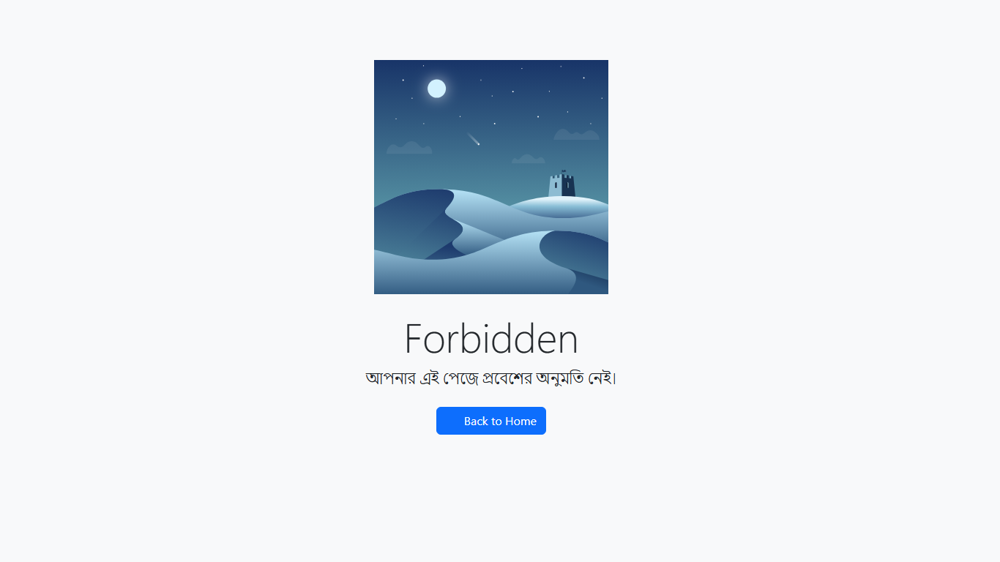
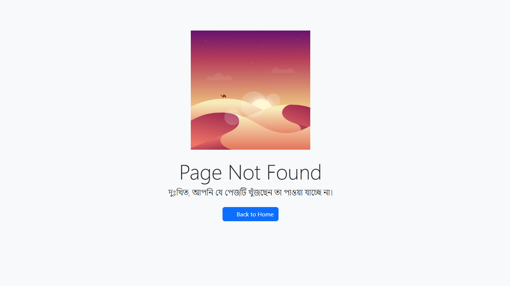
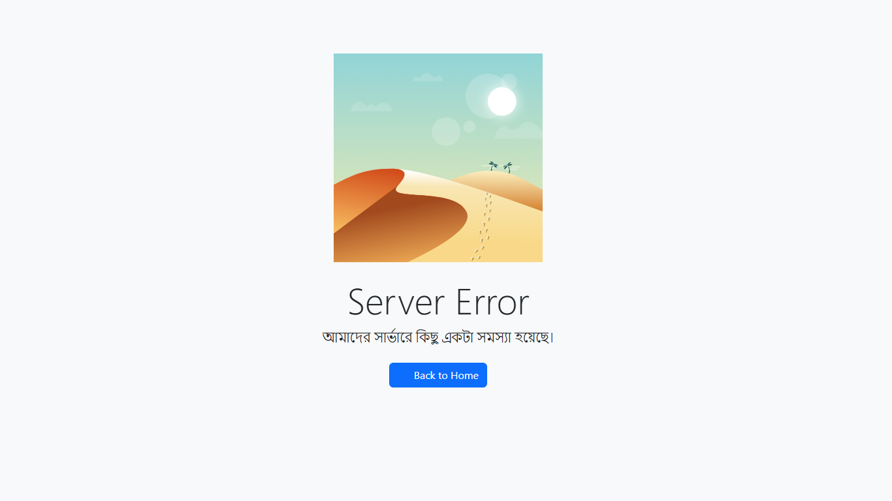
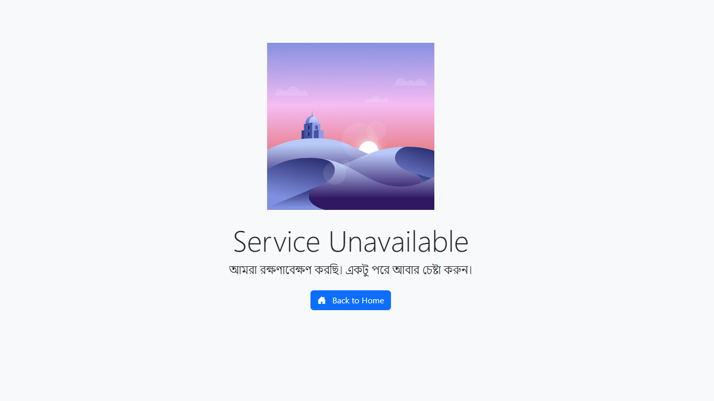

<div align="center">


# 🚨 Laravel Error Pages

### Laravel-এর জন্য সুন্দর, রেডিমেড HTTP এরর পেজ — এবং একটি সম্পূর্ণ বিগিনার টিউটোরিয়াল: নিজেই Laravel প্যাকেজ বানান ✨

[](https://packagist.org/packages/delwarhossaindev/laravel-error-pages)
[](https://packagist.org/packages/delwarhossaindev/laravel-error-pages)
[](https://www.php.net/)
[](https://laravel.com)
[](LICENSE)

<p>
  <a href="https://github.com/delwarhossaindev/laravel-error-pages">🌐 সোর্স কোড</a> •
  <a href="#quick-install">⚡ দ্রুত ইনস্টল</a> •
  <a href="#tutorial">📚 টিউটোরিয়াল</a> •
  <a href="#glossary">📖 পরিভাষা</a>
</p>

</div>

---

## 📚 এই README সম্পর্কে

এই ফাইলটি **দুটি** কাজ করে:

১. **প্যাকেজের ডকুমেন্টেশন** — ইনস্টল করুন, assets পাবলিশ করুন, কাস্টমাইজ করুন, শেষ।
২. **নিজে প্যাকেজ বানাতে শেখায়** — এই প্যাকেজটিকে উদাহরণ হিসেবে ব্যবহার করে সম্পূর্ণ বিগিনার-বান্ধব গাইড।

> 🎓 আপনি যদি আগে কখনো Composer/Laravel প্যাকেজ না বানিয়ে থাকেন, তাহলে **[সম্পূর্ণ টিউটোরিয়াল](#tutorial)** অংশে যান। প্রতিটি ধাপ বাস্তব — এই রিপোতে যত কমান্ড, ফাইল এবং সিদ্ধান্ত দেখছেন, সবকিছু নিচে ধাপে ধাপে ডকুমেন্ট করা আছে।

---

## <a id="quick-install"></a>⚡ দ্রুত ইনস্টল (শুধু ব্যবহার করতে চাইলে?)

```bash
composer require delwarhossaindev/laravel-error-pages
php artisan vendor:publish --tag=error-pages
```

ব্যস, এটুকুই। যেকোনো জায়গায় `abort(404)` দিন — সুন্দর স্টাইল করা পেজ দেখতে পাবেন। বিস্তারিতের জন্য [কাস্টমাইজেশন](#customization) বা [সমস্যা সমাধান](#troubleshooting) দেখুন।

---

## ✨ বৈশিষ্ট্যসমূহ

| 🚀 | মাত্র একটি কমান্ডে ইনস্টল ও পাবলিশ |
|----|--------------------------------------|
| 🎯 | **401, 402, 403, 404, 419, 429, 500, 503** — ৮টি HTTP error page অন্তর্ভুক্ত |
| 🖼️ | Split-screen illustrated layout — বাম পাশে বার্তা, ডান পাশে **SVG ইলাস্ট্রেশন** |
| 🎨 | ৪টি SVG (403, 404, 500, 503) দিয়ে সব page কভার — প্রতিটি blade-এ সরাসরি SVG নির্ধারিত |
| 🌍 | **Translation-ready** — `resources/lang/en/auth.php` publish করে সব ভাষায় কাস্টমাইজ |
| 🧩 | একটি শেয়ার্ড `illustrated-layout.blade.php` — একবার পরিবর্তন করলে সব জায়গায় প্রযোজ্য |
| ⚡ | Service Provider স্বয়ংক্রিয়ভাবে আবিষ্কৃত হয় |
| 🦾 | Laravel **5.x → 12.x** এবং PHP **5.5.9 → 8.x** সাপোর্ট |
| 📦 | MIT লাইসেন্স |

---

## 🖼️ প্রিভিউ

> 📸 Split-screen illustrated layout — বাম পাশে error code ও বার্তা, ডান পাশে SVG illustration। মাত্র **৪টি SVG** দিয়ে **৮টি** HTTP error page কভার করা হয়েছে।

<table>
  <tr>
    <td align="center">
      
      <br/>
      <strong>403.svg</strong>
      <br/>
      <sub>401 · 402 · 403 · 419 · 429</sub>
    </td>
    <td align="center">
      
      <br/>
      <strong>404.svg</strong>
      <br/>
      <sub>404</sub>
    </td>
  </tr>
  <tr>
    <td align="center">
      
      <br/>
      <strong>500.svg</strong>
      <br/>
      <sub>500</sub>
    </td>
    <td align="center">
      
      <br/>
      <strong>503.svg</strong>
      <br/>
      <sub>503</sub>
    </td>
  </tr>
</table>

---

# <a id="tutorial"></a>📚 সম্পূর্ণ টিউটোরিয়াল — নিজেই Laravel প্যাকেজ বানান

> 👋 **স্বাগতম!** এই টিউটোরিয়ালটি ধরে নিচ্ছে আপনি Composer প্যাকেজ সম্পর্কে **একদম কিছু জানেন না**। শেষ পর্যন্ত আপনার নিজের একটি প্যাকেজ Packagist-এ থাকবে, যেটি যেকেউ `composer require` দিয়ে ইনস্টল করতে পারবে।
>
> উদাহরণ হিসেবে **এই রিপোটি** (`delwarhossaindev/laravel-error-pages`) ব্যবহার করা হবে। আপনি যত কমান্ড ও ফাইল দেখছেন সব বাস্তব — clone করুন, দেখুন, তারপর নিজেরটা বানান।

## 🗺️ সামগ্রিক চিত্র

```
┌─────────────────────────────────────────────────────────────┐
│                                                             │
│  📐 পরিকল্পনা ──► ⚒️ তৈরি ──► 🧪 পরীক্ষা ──► 🚀 প্রকাশ ──► 🔄 রক্ষণাবেক্ষণ │
│                                                             │
│   ধাপ ১-২        ধাপ ৩-৭      ধাপ ৮         ধাপ ৯-১৩      ধাপ ১৪       │
│                                                             │
└─────────────────────────────────────────────────────────────┘
```

| পর্যায় | আপনি কী করবেন | ফলাফল |
|--------|---------------|-------|
| 📐 **১. পরিকল্পনা** | নাম, namespace, লাইসেন্স ঠিক করুন | একটি খালি ফোল্ডার ও পরিষ্কার ধারণা |
| ⚒️ **২. তৈরি** | `composer.json`, ServiceProvider, resources লিখুন | ডিস্কে কার্যকর প্যাকেজ |
| 🧪 **৩. পরীক্ষা** | Validate করুন, path repo দিয়ে Laravel অ্যাপে ইনস্টল করুন | নিশ্চিত হলো যে কাজ করছে |
| 🚀 **৪. প্রকাশ** | Git → GitHub → Tag → Packagist | বিশ্বের যেকেউ ইনস্টল করতে পারবে |
| 🔄 **৫. রক্ষণাবেক্ষণ** | নতুন রিলিজে SemVer ব্যবহার করুন | ভার্সন করা আপডেট |

---

## 🛠️ শুরু করার আগে যা লাগবে

আপনার মেশিনে এই টুলগুলো ইনস্টল করুন:

| টুল | কাজ | ভার্সন চেক |
|-----|-----|-----------|
| 🐘 **PHP** | কোড রান করে | `php -v` *(৭.২+ রেকমেন্ডেড)* |
| 📦 **Composer** | PHP-র প্যাকেজ ম্যানেজার | `composer --version` |
| 🌿 **Git** | ভার্সন কন্ট্রোল | `git --version` |
| 🐙 **GitHub অ্যাকাউন্ট** | কোড হোস্ট করতে | <https://github.com/signup> |
| 📦 **Packagist অ্যাকাউন্ট** | প্যাকেজ পাবলিশ করতে | <https://packagist.org/login> *(GitHub দিয়ে লগিন করুন)* |
| ✏️ **কোড এডিটর** | VS Code, PhpStorm ইত্যাদি | — |

> 💡 Laravel অ্যাপ ইনস্টল না থাকলেও চলবে — তবে প্যাকেজ **পরীক্ষা** করার সময় একটি লাগবে।

---

## 🧾 এক নজরে সব কমান্ড

> 📋 **শূন্য থেকে Packagist-এ প্রকাশ** পর্যন্ত প্রতিটি কমান্ড, ক্রমানুসারে।
> `yourusername`, `Your Name`, `you@example.com` এবং `laravel-error-pages` — নিজের তথ্য দিয়ে বদলে নিন।

### 🎬 ধাপে ধাপে (ব্যাখ্যাসহ)

```bash
# ════════════════════════════════════════════════════════════
#  পর্যায় ১ — পরিকল্পনা ও ফোল্ডার তৈরি
# ════════════════════════════════════════════════════════════

mkdir laravel-error-pages
cd laravel-error-pages
mkdir -p src resources/views/errors resources/svg


# ════════════════════════════════════════════════════════════
#  পর্যায় ২ — তৈরি (এই ফাইলগুলো এডিটরে নিজে লিখুন)
# ════════════════════════════════════════════════════════════
#
#   • composer.json
#   • src/ErrorPagesServiceProvider.php
#   • resources/views/errors/layout.blade.php
#   • resources/views/errors/{401,402,403,404,419,429,500,503}.blade.php
#   • resources/svg/{403,404,500,503}.svg
#   • LICENSE, .gitignore, .gitattributes, README.md
#
# (প্রতিটি ফাইলের বিষয়বস্তুর জন্য নিচের টিউটোরিয়াল দেখুন)


# ════════════════════════════════════════════════════════════
#  পর্যায় ৩ — লোকালি পরীক্ষা করুন
# ════════════════════════════════════════════════════════════

# ৩ক. composer.json যাচাই করুন
composer validate --strict

# ৩খ. (ঐচ্ছিক) প্যাকেজ ফোল্ডারের ভেতর dev dependencies ইনস্টল করুন
composer install

# ৩গ. path repository দিয়ে একটি বাস্তব Laravel অ্যাপে পরীক্ষা করুন
#     (এই কমান্ডগুলো Laravel অ্যাপের ভেতর থেকে চালান, প্যাকেজ ফোল্ডার থেকে নয়)
#
#     প্রথমে অ্যাপের composer.json-এ যোগ করুন:
#       "repositories": [
#         { "type": "path", "url": "../laravel-error-pages" }
#       ]
#
#     তারপর:
composer require yourusername/laravel-error-pages:@dev
php artisan vendor:publish --tag=error-pages
php artisan view:clear


# ════════════════════════════════════════════════════════════
#  পর্যায় ৪ — GitHub ও Packagist-এ প্রকাশ করুন
# ════════════════════════════════════════════════════════════

# ৪ক. (মাত্র একবার) Git পরিচয় সেট করুন
git config --global user.name "Your Name"
git config --global user.email "you@example.com"

# ৪খ. রিপো শুরু করুন এবং প্রথম commit করুন
git init
git add .
git commit -m "Initial commit: package skeleton"

# ৪গ. github.com/new-এ একটি Public রিপো তৈরি করুন (README/license যোগ করবেন না),
#     তারপর connect ও push করুন:
git remote add origin https://github.com/yourusername/laravel-error-pages.git
git branch -M main
git push -u origin main

# ৪ঘ. প্রথম রিলিজ tag করুন (Composer Git tag পড়ে version নির্ধারণ করে)
git tag v1.0.0
git push origin v1.0.0

# ৪ঙ. Packagist-এ সাবমিট করুন:
#     ১. https://packagist.org-এ লগিন করুন (Login with GitHub)
#     ২. "Submit" বাটনে ক্লিক করুন
#     ৩. রিপো URL পেস্ট করুন: https://github.com/yourusername/laravel-error-pages
#     ৪. Check → Submit
#
# ৪চ. প্রতিটি push-এ Packagist স্বয়ংক্রিয় আপডেট পাক সেজন্য webhook সেট করুন:
#     সহজ উপায়: https://github.com/apps/packagist রিপোতে install করুন


# ════════════════════════════════════════════════════════════
#  পর্যায় ৫ — নতুন ভার্সন রিলিজ (যখনই কোড পরিবর্তন করবেন)
# ════════════════════════════════════════════════════════════

git add .
git commit -m "fix: 404 message ঠিক করা হয়েছে"
git push

# SemVer অনুযায়ী ভার্সন বাড়ান:
#   v1.0.0 → v1.0.1   শুধু বাগ ঠিক হলে
#   v1.0.1 → v1.1.0   নতুন ফিচার, কিছু ভাঙেনি
#   v1.1.0 → v2.0.0   পুরনো ব্যবহারকারীদের কোড ভাঙবে
git tag v1.0.1
git push origin v1.0.1


# ════════════════════════════════════════════════════════════
#  অন্যরা কীভাবে আপনার প্যাকেজ ইনস্টল করবে
# ════════════════════════════════════════════════════════════

composer require yourusername/laravel-error-pages
php artisan vendor:publish --tag=error-pages
```

### ⚡ শুধু কমান্ড (কোনো ব্যাখ্যা ছাড়া)

```bash
mkdir laravel-error-pages && cd laravel-error-pages
mkdir -p src resources/views/errors resources/svg
# ... এডিটরে ফাইলগুলো তৈরি করুন ...
composer validate --strict
git config --global user.name "Your Name"
git config --global user.email "you@example.com"
git init
git add .
git commit -m "Initial commit"
git remote add origin https://github.com/yourusername/laravel-error-pages.git
git branch -M main
git push -u origin main
git tag v1.0.0
git push origin v1.0.0
```

> ✅ **এটাই সম্পূর্ণ যাত্রা** — খালি ফোল্ডার থেকে শুরু করে বিশ্বের যেকেউ `composer require yourusername/laravel-error-pages` দিয়ে ইনস্টল করতে পারবে।

---

## 📐 পর্যায় ১ — পরিকল্পনা

### ধাপ ১: প্যাকেজের নাম ঠিক করুন

Composer প্যাকেজের নাম দুই অংশে: `vendor/package`।

| অংশ | উদাহরণ | নিয়ম |
|-----|--------|-------|
| `vendor` | `delwarhossaindev` | আপনার GitHub username (বা কোম্পানি) — ছোট হাতের |
| `package` | `laravel-error-pages` | কী করে তার বর্ণনা — ছোট হাতের, হাইফেন দিয়ে আলাদা |

✅ ভালো: `delwarhossaindev/laravel-error-pages`, `spatie/laravel-permission`
❌ খারাপ: `MyAwesomeStuff/Cool_Package` *(বড় হাতের বা আন্ডারস্কোর চলবে না)*

> ⚠️ একবার Packagist-এ প্রকাশ করলে নাম **পরিবর্তন করা যাবে না** — সাবধানে বেছে নিন।

### ধাপ ২: PHP namespace ঠিক করুন

Namespace আপনার কোডের ভেতরে থাকে (`namespace Foo\Bar;`)। নিয়ম হলো vendor ও package নাম PascalCase করা।

আমাদের প্যাকেজের জন্য: `delwarhossaindev/laravel-error-pages` → `Delwarhossaindev\ErrorPages`

> JSON স্ট্রিংয়ের ভেতর `\\` (escaped backslash) ব্যবহার করুন: `"Delwarhossaindev\\ErrorPages\\"`.

---

## ⚒️ পর্যায় ২ — তৈরি

### ধাপ ৩: ফোল্ডার কাঠামো তৈরি করুন

```bash
mkdir laravel-error-pages
cd laravel-error-pages
mkdir -p src resources/views/errors resources/svg
```

চূড়ান্ত যে কাঠামো হবে:

```
laravel-error-pages/
├── composer.json                    ← প্যাকেজের তথ্য
├── LICENSE                          ← MIT, BSD ইত্যাদি
├── README.md                        ← এই ফাইল
├── .gitignore                       ← Git যেগুলো বাদ দেবে
├── .gitattributes                   ← Packagist ডাউনলোডে যা থাকবে না
├── src/
│   └── ErrorPagesServiceProvider.php  ← Laravel-এর সাথে সংযোগ
└── resources/
    ├── views/errors/                ← Blade টেমপ্লেট
    └── svg/                         ← স্ট্যাটিক ফাইল
```

### ধাপ ৪: `composer.json` তৈরি করুন

এই ফাইলটি **প্রতিটি প্যাকেজের প্রাণ**। Composer এটি পড়ে জানে কী ইনস্টল করতে হবে, কী autoload করতে হবে।

`composer.json` তৈরি করুন:

```json
{
    "name": "delwarhossaindev/laravel-error-pages",
    "description": "Beautiful pre-styled Laravel error pages with SVG illustrations.",
    "type": "library",
    "license": "MIT",
    "keywords": ["laravel", "error-pages", "404", "500"],
    "authors": [
        {
            "name": "Your Name",
            "email": "you@example.com",
            "homepage": "https://github.com/yourusername"
        }
    ],
    "homepage": "https://github.com/yourusername/laravel-error-pages",
    "support": {
        "issues": "https://github.com/yourusername/laravel-error-pages/issues",
        "source": "https://github.com/yourusername/laravel-error-pages"
    },
    "require": {
        "php": "^5.5.9|^7.0|^8.0",
        "illuminate/support": "^5.0|^6.0|^7.0|^8.0|^9.0|^10.0|^11.0|^12.0"
    },
    "autoload": {
        "psr-4": {
            "Delwarhossaindev\\ErrorPages\\": "src/"
        }
    },
    "extra": {
        "laravel": {
            "providers": [
                "Delwarhossaindev\\ErrorPages\\ErrorPagesServiceProvider"
            ]
        }
    },
    "minimum-stability": "stable",
    "prefer-stable": true
}
```

#### প্রতিটি field-এর ব্যাখ্যা

| Field | কাজ |
|-------|-----|
| `name` | `vendor/package` slug — ব্যবহারকারী এটিই `composer require`-এ লেখে |
| `description` | এক লাইনের সারসংক্ষেপ — Packagist ও সার্চ রেজাল্টে দেখায় |
| `type` | `"library"` মানে পুনর্ব্যবহারযোগ্য কোড; `"project"` মানে পূর্ণ অ্যাপ |
| `license` | SPDX আইডেন্টিফায়ার (`MIT`, `Apache-2.0`, `BSD-3-Clause`) |
| `keywords` | Packagist সার্চের জন্য ট্যাগ |
| `authors` | কে লিখেছে। Email ঐচ্ছিক কিন্তু দেওয়া ভালো |
| `homepage` / `support` | Packagist-এ দেখানো লিংক |
| `require` | প্রয়োজনীয় নির্ভরতা — PHP এর সর্বনিম্ন ভার্সন ও Laravel কম্পোনেন্ট |
| `autoload.psr-4` | namespace → ফোল্ডার ম্যাপিং। **দুটোই backslash/slash দিয়ে শেষ হবে** |
| `extra.laravel.providers` | Laravel auto-discovery — ব্যবহারকারীকে ম্যানুয়ালি register করতে হবে না |
| `minimum-stability` / `prefer-stable` | ডিফল্টে শুধু stable রিলিজ অনুমোদন করে |

### ধাপ ৫: ServiceProvider তৈরি করুন

এটিই একমাত্র PHP ফাইল যেটা আসলে দরকার। `src/ErrorPagesServiceProvider.php` তৈরি করুন:

```php
<?php

namespace Delwarhossaindev\ErrorPages;

use Illuminate\Support\ServiceProvider;

class ErrorPagesServiceProvider extends ServiceProvider
{
    public function boot()
    {
        $this->loadViewsFrom(__DIR__ . '/../resources/views', 'error-pages');

        $this->publishes(array(
            __DIR__ . '/../resources/views/errors' => resource_path('views/errors'),
        ), 'error-pages-views');

        $this->publishes(array(
            __DIR__ . '/../resources/svg' => public_path('svg'),
        ), 'error-pages-assets');

        $this->publishes(array(
            __DIR__ . '/../resources/views/errors' => resource_path('views/errors'),
            __DIR__ . '/../resources/svg' => public_path('svg'),
        ), 'error-pages');
    }

    public function register()
    {
        //
    }
}
```

#### কী হচ্ছে?

- `boot()` — সব provider register হওয়ার পর চলে। এখানে সবকিছু সংযুক্ত করার আদর্শ জায়গা।
- `loadViewsFrom()` — Laravel-কে বলে প্যাকেজের ভেতরে view খুঁজতে (`error-pages::` prefix দিয়ে)।
- `publishes()` — ব্যবহারকারী `php artisan vendor:publish` চালালে কোন ফাইল কোথায় কপি হবে তা নিবন্ধন করে।
- দ্বিতীয় argument হলো **tag** — ব্যবহারকারী বেছে নিতে পারে: শুধু views, শুধু assets, বা দুটোই।

> 💡 `: void` return type ব্যবহার করা হয়নি যাতে PHP 5.6+-এও কাজ করে। একই কারণে `[]`-এর বদলে `array()` ব্যবহার করা হয়েছে।

### ধাপ ৬: Resources যোগ করুন

#### Blade ভিউ (`resources/views/errors/`)

একটি শেয়ার্ড `illustrated-layout.blade.php`, তারপর প্রতিটি HTTP error code-এর জন্য একটি ফাইল যা সেটি extend করে:

**`illustrated-layout.blade.php`** — split-screen shell (CSS, কাঠামো, "Back to Home" বাটন)
**`401`, `402`, `403`, `404`, `419`, `429`, `500`, `503`.blade.php** — প্রতিটিতে code, title, image (SVG), message সেট করা:

```blade
@extends('errors::illustrated-layout')

@section('code', '404')
@section('title', __('auth.page_not_found'))

@section('image')
<div style="background-image: url({{ asset('/svg/404.svg') }});"
     class="absolute pin bg-cover bg-no-repeat md:bg-left lg:bg-center">
</div>
@endsection

@section('message', __('auth.page_not_found_msg'))
```

> 💡 Laravel **স্বয়ংক্রিয়ভাবে** HTTP error-এর জন্য `errors/{status}.blade.php` খোঁজে। তাই ফাইলের নাম হুবহু এরকম হতে হবে।

#### SVG ও error code ম্যাপিং

প্রতিটি blade ফাইলে সরাসরি কোন SVG দেখাবে তা নির্ধারিত:

| SVG | যে error page গুলো ব্যবহার করে |
|-----|-------------------------------|
| `403.svg` | 401, 402, 403, 419, 429 |
| `404.svg` | 404 |
| `500.svg` | 500 |
| `503.svg` | 503 |

#### SVG ইলাস্ট্রেশন (`resources/svg/`)

SVG ফাইলগুলো ফোল্ডারে রেখে দিন। বিনামূল্যে ইলাস্ট্রেশনের জন্য [unDraw](https://undraw.co) বা [Storyset](https://storyset.com) ব্যবহার করতে পারেন।

### ধাপ ৭: মেটা ফাইল যোগ করুন

যেকোনো গুরুত্বপূর্ণ প্যাকেজে এই তিনটি ফাইল অবশ্যই থাকতে হবে।

#### `LICENSE` — Packagist-এর জন্য আবশ্যক

[MIT টেমপ্লেট](https://opensource.org/licenses/MIT) কপি করুন, নিজের নাম ও বছর বসান:

```
MIT License

Copyright (c) 2026 Your Name

Permission is hereby granted, free of charge, to any person obtaining a copy
...
```

#### `.gitignore` — অপ্রয়োজনীয় ফাইল Git থেকে বাদ রাখুন

```
/vendor/
composer.lock
.idea/
.vscode/
.DS_Store
Thumbs.db
*.log
.phpunit.result.cache
```

> ❓ **`composer.lock` কেন ignore করবেন?** অ্যাপ dependencies lock করে; library করে না — প্রতিটি project-এ নতুনভাবে resolve হওয়া উচিত।

#### `.gitattributes` — `composer require` ডাউনলোডে tests/docs রাখবেন না

```
/.gitattributes      export-ignore
/.gitignore          export-ignore
/.github             export-ignore
/tests               export-ignore
/phpunit.xml         export-ignore
/phpunit.xml.dist    export-ignore
/.editorconfig       export-ignore
* text=auto eol=lf
```

> 💡 `export-ignore` মানে "Composer, ব্যবহারকারীরা ইনস্টল করলে এটি অন্তর্ভুক্ত করো না" — ডাউনলোডের আকার ছোট রাখে।

---

## 🧪 পর্যায় ৩ — পরীক্ষা

### ধাপ ৮: লোকালি যাচাই করুন

#### ক. `composer.json` লিন্ট করুন

```bash
composer validate --strict
```

প্রত্যাশিত আউটপুট:

```
./composer.json is valid
```

#### খ. Path repository দিয়ে বাস্তব Laravel অ্যাপে পরীক্ষা করুন

Packagist-এ প্রকাশ না করেও পরীক্ষা করা যায়। **Path repository** ব্যবহার করুন:

টেস্ট Laravel অ্যাপের `composer.json`-এ যোগ করুন:

```json
"repositories": [
    {
        "type": "path",
        "url": "../laravel-error-pages"
    }
]
```

তারপর:

```bash
composer require delwarhossaindev/laravel-error-pages:@dev
php artisan vendor:publish --tag=error-pages
```

এখন যেকোনো অস্তিত্বহীন route-এ যান — কাস্টম 404 পেজ দেখতে পাবেন। 🎉

> ⚠️ কোনো সমস্যা থাকলে **এখনই ঠিক করুন** — Packagist-এ প্রকাশের পর ঠিক করা অনেক ঝামেলার।

---

## 🚀 পর্যায় ৪ — প্রকাশ

### ধাপ ৯: Git শুরু করুন

```bash
cd laravel-error-pages
git init
git add .
git commit -m "Initial commit: package skeleton"
```

> ⚠️ প্রথমবার Git ব্যবহার করছেন? একবার পরিচয় সেট করুন:
> ```bash
> git config --global user.name "Your Name"
> git config --global user.email "you@example.com"
> ```

### ধাপ ১০: GitHub-এ push করুন

১. <https://github.com/new>-এ যান
২. Repo name: `laravel-error-pages` (প্যাকেজের দ্বিতীয় অংশের সাথে মিলবে)
৩. **Public** visibility (Packagist-এর জন্য এটি আবশ্যক)
৪. README, license বা `.gitignore` **যোগ করবেন না** — আপনার কাছে ইতিমধ্যে আছে
৫. **Create repository** ক্লিক করুন

এখন local রিপো সংযুক্ত করুন:

```bash
git remote add origin https://github.com/yourusername/laravel-error-pages.git
git branch -M main
git push -u origin main
```

### ধাপ ১১: প্রথম রিলিজ tag করুন

Composer/Packagist **Git tag** পড়ে ভার্সন নির্ধারণ করে।

```bash
git tag v1.0.0
git push origin v1.0.0
```

#### 📐 SemVer সংক্ষিপ্ত গাইড

```
v[MAJOR].[MINOR].[PATCH]
   │         │       │
   │         │       └── শুধু বাগ ঠিক          (1.0.0 → 1.0.1)
   │         └────────── নতুন ফিচার, কিছু ভাঙেনি (1.0.1 → 1.1.0)
   └──────────────────── ভাঙে এমন পরিবর্তন      (1.1.0 → 2.0.0)
```

| পরিবর্তনের ধরন | কোনটি বাড়াবেন |
|---------------|--------------|
| টাইপো ঠিক, বাগ ঠিক | PATCH `1.0.X` |
| নতুন method, নতুন Laravel সাপোর্ট | MINOR `1.X.0` |
| class rename, PHP 7 সাপোর্ট বাদ | MAJOR `X.0.0` |

> 🚨 একবার tag push হলে **কখনো পরিবর্তন বা মুছবেন না**। Composer tag অনুযায়ী cache করে।

### ধাপ ১২: Packagist-এ সাবমিট করুন

১. <https://packagist.org>-এ সাইন ইন করুন (**Login with GitHub** দিয়ে)
২. উপরে-ডানে **Submit** ক্লিক করুন
৩. রিপো URL পেস্ট করুন: `https://github.com/yourusername/laravel-error-pages`
৪. **Check** → **Submit** ক্লিক করুন

কয়েক সেকেন্ডের মধ্যে আপনার প্যাকেজ live হবে:
`https://packagist.org/packages/yourusername/laravel-error-pages`

### ধাপ ১৩: স্বয়ংক্রিয় আপডেট সেট করুন

ডিফল্টে Packagist প্রতি ২৪ ঘণ্টায় একবার চেক করে। প্রতিটি push-এ **সাথে সাথে** আপডেট পেতে webhook সেট করুন:

#### অপশন A — GitHub App (সহজ, রেকমেন্ডেড)

১. <https://github.com/apps/packagist>-এ যান
২. **Install** ক্লিক করুন → রিপো বেছে নিন

#### অপশন B — ম্যানুয়াল Webhook

১. Packagist-এ: **Profile** → **Show API Token** → কপি করুন
২. GitHub রিপোতে: **Settings** → **Webhooks** → **Add webhook**
৩. Payload URL: `https://packagist.org/api/github?username=YOUR_PACKAGIST_USERNAME`
৪. Content type: `application/json`
৫. Secret: আপনার API token
৬. Save করুন

---

## 🔄 পর্যায় ৫ — রক্ষণাবেক্ষণ

### ধাপ ১৪: নতুন ভার্সন রিলিজ করুন

যখনই কোড পরিবর্তন করবেন:

```bash
git add .
git commit -m "fix: 404 message ঠিক করা হয়েছে"
git push

# SemVer অনুযায়ী নতুন tag দিন
git tag v1.0.1
git push origin v1.0.1
```

Packagist (ধাপ ১৩-র webhook সহ) সাথে সাথে আপডেট হবে।

### 🧠 বিশেষজ্ঞ পরামর্শ

- ✅ `CHANGELOG.md` লিখুন যাতে ব্যবহারকারীরা কী পরিবর্তন হলো জানতে পারে।
- ✅ PHPUnit দিয়ে automated test যোগ করুন (উন্নত বিষয় — আলাদা গাইড)।
- ✅ প্রতিটি PR-এ test চালাতে GitHub Actions সেট করুন।
- ❌ secret push করবেন না — শুধু `.env.example` ব্যবহার করুন।
- ❌ SemVer ভাঙবেন না — আপনার ব্যবহারকারীরা এটির উপর নির্ভর করে।

---

# 📦 এই প্যাকেজটি ব্যবহার করুন

## 📋 প্রয়োজনীয়তা

| সফটওয়্যার | ভার্সন |
|-----------|--------|
| 🐘 PHP | `^5.5.9 \| ^7.0 \| ^8.0` *(5.5.9 থেকে 8.x পর্যন্ত যেকোনো ভার্সন)* |
| 🚀 Laravel | `5.x` · `6.x` · `7.x` · `8.x` · `9.x` · `10.x` · `11.x` · `12.x` *(সব ভার্সন)* |
| 🎨 AdminLTE | `public/adminlte/css/adminlte.min.css` *(ঐচ্ছিক — [কাস্টমাইজেশন](#customization) দেখুন)* |

## ⚡ ইনস্টলেশন

```bash
composer require delwarhossaindev/laravel-error-pages
php artisan vendor:publish --tag=error-pages
```

## 🏷️ পাবলিশের বিকল্পসমূহ

| Tag | কী পাবলিশ হবে |
|-----|--------------|
| `error-pages-views` | শুধু Blade ভিউ (`resources/views/errors/`) |
| `error-pages-assets` | শুধু SVG ইলাস্ট্রেশন (`public/svg/`) |
| `error-pages-lang` | শুধু Translation file (`lang/en/auth.php`) |
| `error-pages` | সবকিছু (views + assets + lang) |

## <a id="customization"></a>🎨 কাস্টমাইজেশন

পাবলিশ করার পর সব ফাইল আপনার অ্যাপে থাকে — যা ইচ্ছা পরিবর্তন করুন।

### টাইটেল ও বার্তা পরিবর্তন করুন

`lang/en/auth.php` পাবলিশ করে translation keys এডিট করুন:

```bash
php artisan vendor:publish --tag=error-pages-lang
```

```php
// lang/en/auth.php
'page_not_found'     => 'উফ! পেজ পাওয়া যাচ্ছে না',
'page_not_found_msg' => 'আপনি যে পেজটি খুঁজছেন তা আর নেই।',
```

### ইলাস্ট্রেশন বদলান

`public/svg/{403,404,500,503}.svg`-এ নিজের SVG ফেলুন — একই নাম রাখুন, কোডে কিছু পরিবর্তন লাগবে না।

### Layout কাস্টমাইজ করুন

পাবলিশ-করা `resources/views/errors/illustrated-layout.blade.php` এডিট করুন — রং, font, বাটনের স্টাইল সব কিছু এখানে।

### নতুন HTTP error যোগ করুন

পাবলিশ-করা `resources/views/errors/`-এ নতুন একটি ফাইল রাখুন (যেমন `405.blade.php`):

```blade
@extends('errors::illustrated-layout')

@section('code', '405')
@section('title', 'Method Not Allowed')

@section('image')
<div style="background-image: url({{ asset('/svg/404.svg') }});"
     class="absolute pin bg-cover bg-no-repeat md:bg-left lg:bg-center">
</div>
@endsection

@section('message', 'এই URL-এ এই method সমর্থিত নয়।')
```

---

## <a id="troubleshooting"></a>🛟 সমস্যা সমাধান

<details>
<summary><strong>😕 এখনো Laravel-এর ডিফল্ট এরর পেজ দেখাচ্ছে</strong></summary>

```bash
php artisan vendor:publish --tag=error-pages
php artisan view:clear
```
</details>

<details>
<summary><strong>🖼️ SVG লোড হচ্ছে না (ভাঙা ছবি দেখাচ্ছে)</strong></summary>

নিশ্চিত করুন SVG গুলো `public/svg/`-এ পাবলিশ হয়েছে। কাস্টম `public_path()` ব্যবহার করলে `layout.blade.php`-এর `` `src` আপডেট করুন।
</details>

<details>
<summary><strong>🎨 Layout-এ কোনো স্টাইল নেই</strong></summary>

`illustrated-layout.blade.php`-এ সব CSS inline আছে — কোনো বাইরের framework লাগে না। Font লোড না হলে Google Fonts CDN connection চেক করুন।
</details>

<details>
<summary><strong>🧪 লোকালি ৫০০ পেজ কীভাবে দেখব?</strong></summary>

```bash
# .env ফাইলে
APP_DEBUG=false
```
```bash
php artisan config:clear
```
তারপর যেকোনো uncaught exception তৈরি করুন।
</details>

<details>
<summary><strong>💥 composer require-এর পর "Class not found" দেখাচ্ছে</strong></summary>

```bash
composer dump-autoload
```
তারপরও না হলে দেখুন `composer.json`-এর `psr-4` namespace আর PHP ফাইলে `namespace` ডিক্লারেশন হুবহু মিলছে কিনা।
</details>

<details>
<summary><strong>📦 Packagist-এ পুরনো ভার্সন দেখাচ্ছে</strong></summary>

Webhook সেট করুন (ধাপ ১৩) অথবা Packagist প্যাকেজ পেজে **Update** ক্লিক করুন। নতুন ভার্সন tag করে push করেছেন কিনা নিশ্চিত করুন।
</details>

---

## <a id="glossary"></a>📖 পরিভাষা

| শব্দ | অর্থ |
|------|------|
| **Composer** | PHP-র প্যাকেজ ম্যানেজার — Node.js-এর npm-এর মতো |
| **Packagist** | Composer প্যাকেজের ডিফল্ট পাবলিক রেজিস্ট্রি |
| **Vendor** | প্যাকেজ নামের প্রথম অংশ (`vendor/package`) — সাধারণত আপনার username |
| **PSR-4** | আধুনিক autoloading স্ট্যান্ডার্ড — namespace prefix → ফোল্ডার ম্যাপ করে |
| **Service Provider** | Laravel-এর hook — binding, view, route ইত্যাদি register করতে ব্যবহৃত |
| **Auto-discovery** | Laravel ফিচার যেখানে প্যাকেজ `composer.json` দিয়ে নিজেই register হয় |
| **Publishing** | প্যাকেজের ফাইল (view, config, asset) ব্যবহারকারীর অ্যাপে কপি করা |
| **Tag** | Git-এর নামকরণ করা pointer (যেমন `v1.0.0`) — Composer tag পড়ে version বোঝে |
| **SemVer** | Semantic Versioning: MAJOR.MINOR.PATCH — breaking/feature/fix বোঝায় |
| **Path repository** | লোকাল Composer source যা একটি ফোল্ডার দেখায় — প্যাকেজ লোকালি টেস্ট করতে ব্যবহৃত |
| **Stub / template** | প্যাকেজ পাঠানো ডিফল্ট ফাইল যা `vendor:publish` দিয়ে অ্যাপে কপি হয় |

---

## 🤝 অবদান রাখুন

```bash
১. 🍴 রিপো Fork করুন
২. 🌿 ফিচার branch তৈরি করুন  →  git checkout -b feature/my-feature
৩. 💾 পরিবর্তন commit করুন    →  git commit -m 'দারুণ কিছু যোগ করলাম'
৪. 🚀 Branch push করুন        →  git push origin feature/my-feature
৫. 🎉 Pull Request খুলুন
```

🐛 বাগ? আইডিয়া? Issue খুলুন → <https://github.com/delwarhossaindev/laravel-error-pages/issues>

---

## 💖 কৃতজ্ঞতা

- 👨‍💻 **[Delwar Hossain](https://github.com/delwarhossaindev)** — লেখক ও রক্ষণাবেক্ষণকারী
- 🚀 Laravel + Admin Dashboard কমিউনিটির জন্য তৈরি

---

## 📜 লাইসেন্স

**MIT লাইসেন্স**। পূর্ণ বিবরণের জন্য [LICENSE](LICENSE) দেখুন।

---

<div align="center">

### ⭐ এই গাইড কাজে লাগলে একটি স্টার দিন!

[](https://github.com/delwarhossaindev/laravel-error-pages)

<sub>বাংলাদেশ থেকে ❤️ দিয়ে তৈরি 🇧🇩</sub>

</div>
